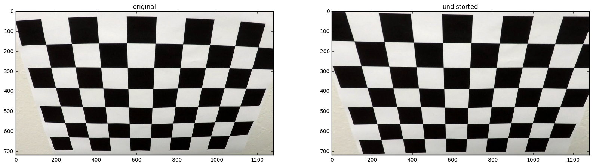
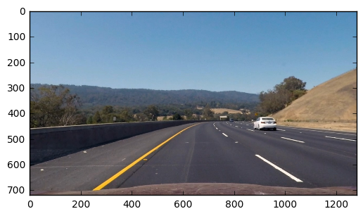
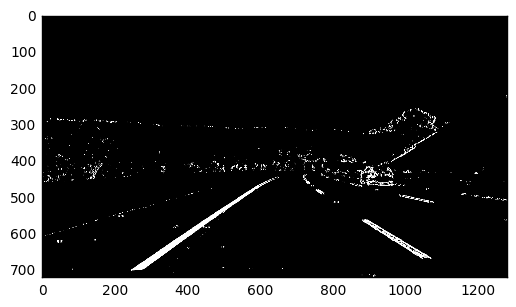
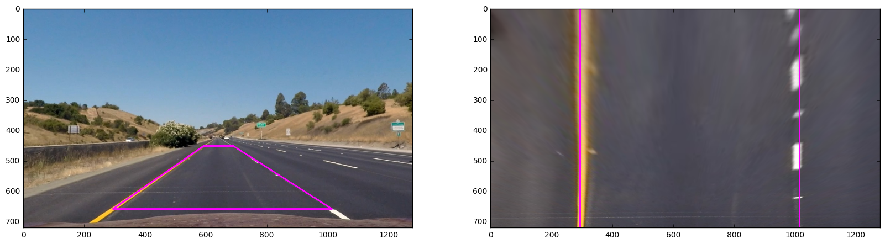
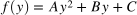
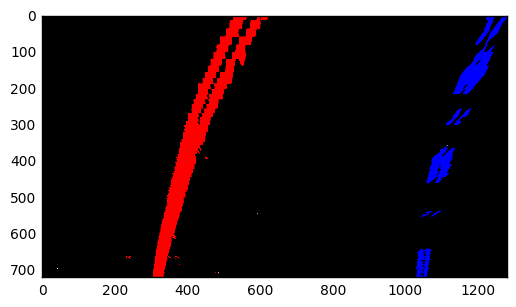
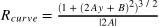
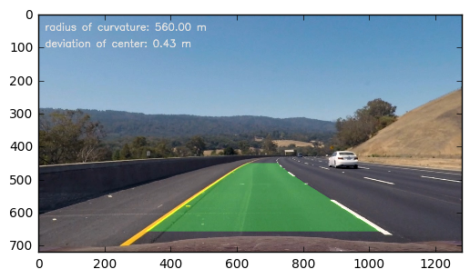

# Advanced Lane Finding Project


```python
import numpy as np
import cv2
import matplotlib.pyplot as plt
import matplotlib.image as mpimg
%matplotlib inline
```

### Camera Calibration 

The **calibration.py** shows how to compute the distortion coefficients using OpenCV:
- There are 9x6=48 point located on the chessboard. (line 13)
- Assuming these object points in the world coordinates are (0,0,0), (1,0,0),...,(8,5,0), which lie on the plane z=0. (line 18)
- I detect these point in image coordinates calling `cv2.findChessboardCorners`. (line 23)
- The distortion coefficients can be computed by applying `cv2.calibrateCamera` to `objpoints` and `imgpoints`. (line 29)


```python
import calibration
ret, mtx, dist, rvecs, tvecs = calibration.calibrate('camera_cal/calibration*.jpg')
```

##### The followings shows the original image compared with distortion correction applied: 


```python
img_file = 'camera_cal/calibration2.jpg'
img = cv2.imread(img_file)
img = cv2.cvtColor(img, cv2.COLOR_BGR2RGB)
undist = cv2.undistort(img, mtx, dist, None, mtx)
fig, ax = plt.subplots(1, 2, figsize=(20, 5))
ax[0].set_title('original')
ax[0].imshow(img)
ax[1].set_title('undistorted')
ax[1].imshow(undist)
```


    <matplotlib.image.AxesImage at 0x273d0fe06d8>





### Pipeline (single images)

##### Distortion correction

I apply the distortion correction to one of the test images like this one:


```python
test_file = 'test_images/test3.jpg'
test_img = cv2.imread(test_file)
test_img = cv2.cvtColor(test_img, cv2.COLOR_BGR2RGB)
undist_test_img = cv2.undistort(test_img, mtx, dist, None, mtx)
plt.imshow(undist_test_img)
```


    <matplotlib.image.AxesImage at 0x273d27f2d30>





##### Output the binary image 

I combined the color transform and gradient filter and thresholded the output to generate the binary image. The functions are implented in ** process.py **, where:

- `undistort` computes the distortion-corrected image with the previous parameters `dist` and `mtx`.
- `sobel_abs` computes the the gradients in the horizontal/ vertical direction.
- `sobel_dir` computes the the angle of the gradient
- `thresh` computes the binary image by applying threshold to the previous outputs

##### The following shows a example ouput by combining the above mentioned functions:


```python
from preprocess import undistort, sobel_abs, sobel_dir, thresh

filename = 'test_images/test3.jpg'
img = cv2.imread(filename)
undist_img = undistort(img, dist, mtx, is_BGR=True)

hls = cv2.cvtColor(undist_img, cv2.COLOR_RGB2HLS)
saturation = hls[...,2]
gray = cv2.cvtColor(undist_img, cv2.COLOR_RGB2GRAY)
gradx = sobel_abs(gray, (30,255), 5)
grady = sobel_abs(gray, (10,255), 5, (0,1))
sat_bin = thresh(saturation, (170,255))


combined = np.zeros_like(sat_bin)
cond = ( (sat_bin == 1) | ((gradx == 1) & (grady==1))  )
combined[cond] = 1
plt.imshow(combined, cmap='gray')
```


    <matplotlib.image.AxesImage at 0x273d286bfd0>





##### Perspective transfom 

Assuming the 4 points lie on the plane and the plane is flat, I chose the points as following:

Source|Destination   
---|---
592, 452|294, 0
690, 452|1014, 0
1014, 659|1014, 720
294, 659|294, 720


```python
from preprocess import pers_transform, src, dst

filename = 'test_images/straight_lines1.jpg'
img = cv2.imread(filename)
undist_straight = undistort(img, dist, mtx, is_BGR=True)


warp = cv2.warpPerspective(undist_straight, pers_transform, combined.shape[::-1], flags=cv2.INTER_LINEAR)

undist_img_drawn = np.copy(undist_straight)
cv2.polylines(undist_img_drawn, [src.astype(np.int32)], True, (255,0,255), 3)
warp_drawn = np.copy(warp)
cv2.polylines(warp_drawn, [dst.astype(np.int32)], True, (255,0,255), 3)
plt.figure(figsize=(20,6))
ax1 = plt.subplot(121)
ax1.imshow(undist_img_drawn)
ax2 = plt.subplot(122)
ax2.imshow(warp_drawn)
```


    <matplotlib.image.AxesImage at 0x273d387fda0>





##### Fit the lane lines in the warped binary image 

I took the code from the course with some modifications. I increased the searching windows and the searching width along with an early stopping condition.

The equation to fit to lines is quadratic polynomial:



With this modified window-sliding algorithm I fit my lane lines as following:


```python
from lane_finding import slide_window

combined_warp = cv2.warpPerspective(combined, pers_transform, combined.shape[::-1], flags=cv2.INTER_LINEAR)

out, left, right, left_m, right_m = slide_window(combined_warp, draw=True)
plt.imshow(out)
```


    <matplotlib.image.AxesImage at 0x273d3954a20>





##### Measuring curvature



where **A,B** are the coefficients of the fit quadratic polynomial.


```python
from lane_finding import calculate_radii, calculate_deviation
y_bottom = 720
width = 1200
left_radius, right_radius = calculate_radii(y_bottom, left_m, right_m)
radius_curv = 0.5 * (left_radius + right_radius)
```

##### Deviation of the center

Assuming the camera is at the center of the car, I compute how far the center deviates from the center of lanes.


```python
from lane_finding import calculate_deviation
deviation = calculate_deviation(y_bottom, width, left_m, right_m)
```

##### Mark the lane in the test image


```python
from preprocess import pers_transform_inv
from lane_finding import draw_info_unwrap
result = draw_info_unwrap(undist_img, pers_transform_inv, left, right, radius_curv, deviation)
plt.imshow(result)
```


    <matplotlib.image.AxesImage at 0x273d7736f98>





### Pipeline (video) 

The [link to my video result](./output_video.mp4)


```python
from moviepy.editor import VideoFileClip
from IPython.display import HTML
from process import Context

ctx = Context()

output = 'output_video.mp4'
project_clip = VideoFileClip("project_video.mp4")
output_clip = project_clip.fl_image(ctx.process)
output_clip.write_videofile(output, audio=False)
```

    [MoviePy] >>>> Building video output_video.mp4
    [MoviePy] Writing video output_video.mp4
    

    100%|████████████████████████████████████████| 1261/1261 [00:59<00:00,  21.37it/s]
    

    [MoviePy] Done.
    [MoviePy] >>>> Video ready: output_video.mp4 
    
    

### Discussion

I have applied the transforms to pipeline to accomplish the visual "lane detecting".

I think the key to the other harder challenges is find a more robust lane-detecting algorithm which can not be done by thresholding the color or the gradients of the image.
